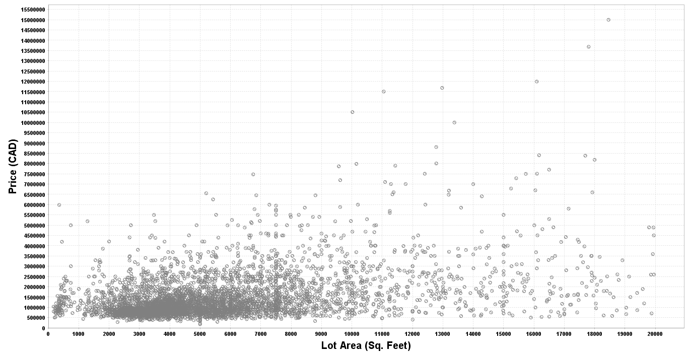
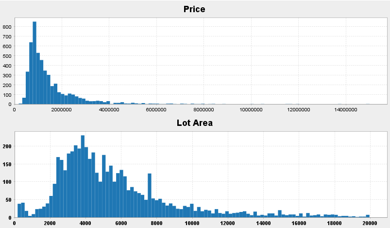
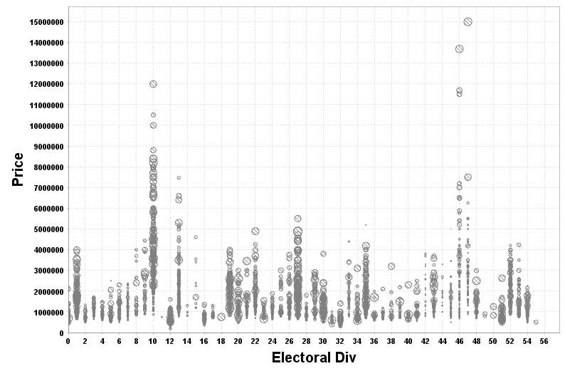
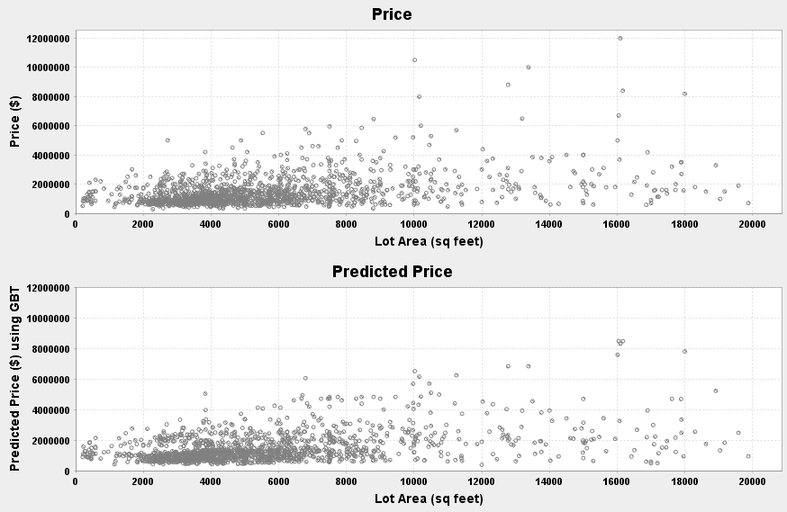

# Predicting Housing Prices in the GTA 


## Data Exploration with spark & breeze-viz

Load data and convert columns to double:

```
import org.apache.spark.sql.SparkSession;
import org.apache.spark.sql.types._;
import org.apache.spark.ml.feature.StringIndexer;
import org.apache.spark.sql.functions.{min, max, log};
import org.apache.spark.sql.DataFrame;
import breeze.plot._;

val spark = SparkSession.builder().master("local[*]")
  .appName("myapp").getOrCreate()

var df = spark.read.format("csv")
  .option("header", "true")
  .load(csvpath)

df.show()
```

To plot data, cast to double and collect:

```
var price = df.select( df("Price").cast(DoubleType).as("Price") ).collect.map(row => row.getDouble(0));
var lotArea = df.select( df("LotArea").cast(DoubleType).as("LotArea") ).collect.map(row => row.getDouble(0));

// For scatter plot, we need to specify the size of each point. For now, we use constant size:
var size = Array.fill(salePrice.length){100} //units of x-axis

var f = Figure();
var p = f.subplot(0);
p += scatter(lotArea,price,size.apply);
```

The raw data has several outliers in both price and lot area.
- Limit price from $100,000 to $15,000,000
- Limit lot area from 100 sq. feet to 100,000 sq. feet.

```
// Remove outliers
// Price from 100,000 to 10,000,000
var df3 = df2.filter(s"Price > 10000 and Price < 15000000");
// Lot Area from 100 to 20,000
var df4 = df3.filter(s"LotArea > 100 and LotArea < 20000");
```

Plotting the data again, it looks much better:



Looking at the distribution of each variable, both variables are right skewed.
```
var f = Figure();
var p = f.subplot(0);
var q = f.subplot(2,1,1);
p += hist(price,bins=100);
p.title = "Price";
q += hist(lotArea,bins=100);
q.title = "Lot Area";
```


using StringIndexer it's possible to look at price per location by changing location to a number 
It's also possible to make the size of the circles proportional to lot area.
```
var indexer = new StringIndexer()
  .setInputCol("ElectoralDiv")
  .setOutputCol("location")
  .setStringOrderType("alphabetAsc");

var df2 = indexer.fit(df).transform(df);

// Collect
var location = df.select("location").collect.map(row => row.getDouble(0));
var size2 = lotArea.map(_*0.00005)
// Plot
var f = Figure();
var p = f.subplot(0);
p += scatter(location,price,size2.apply);

```



## GBT regression with spark

We can do gradient boosting regression to predict price. 

```
// Split Data:
var splitData = df.randomSplit(Array(0.7, 0.3));
var train_df = splitData(0);
var test_df = splitData(1);

//Assemble features:
var assembler = new VectorAssembler()
  .setInputCols(Array("Bathrooms", "Stories", "FullBedrooms", "OtherRooms", "LotArea", "location"))
  .setOutputCol("features")
  .setHandleInvalid("skip")

var gbt = new GBTRegressor()
  .setMaxBins(60)
  .setLabelCol("Price")
  .setFeaturesCol("features")
  .setMaxIter(10)
  .setPredictionCol("gbtPrediction")

var pipeline = new Pipeline()
  .setStages(Array(indexer, assembler, gbt))

// k-fold cross-validation:
var paramGrid = new ParamGridBuilder()
  .addGrid(gbt.maxDepth, Array(3, 5, 7, 9, 11))
  .addGrid(gbt.minInstancesPerNode, Array(1, 2, 3, 4, 5))
  .addGrid(gbt.stepSize, Array(0.01,0.05,0.1,0.2,0.3))
  .build()

var evaluator = new RegressionEvaluator()
  .setLabelCol("Price")
  .setPredictionCol("gbtPrediction")
  .setMetricName("mse");

var cv = new CrossValidator()
  .setEstimator(pipeline)
  .setEvaluator(evaluator)
  .setEstimatorParamMaps(paramGrid)
  .setNumFolds(3)
  .setParallelism(2)

// Train
var cvModel = cv.fit(train_df)

// Test
var preds = cvModel.transform(test_df)
// Get r-square
preds.stat.corr("Price","gbtPrediction")

```

To find out the best set of parameters from the cross validation do:
```
cvModel.getEstimatorParamMaps.zip(cvModel.avgMetrics).maxBy(_._2)._1
```

This is a comparison of actual price and predicted price against lot area.




