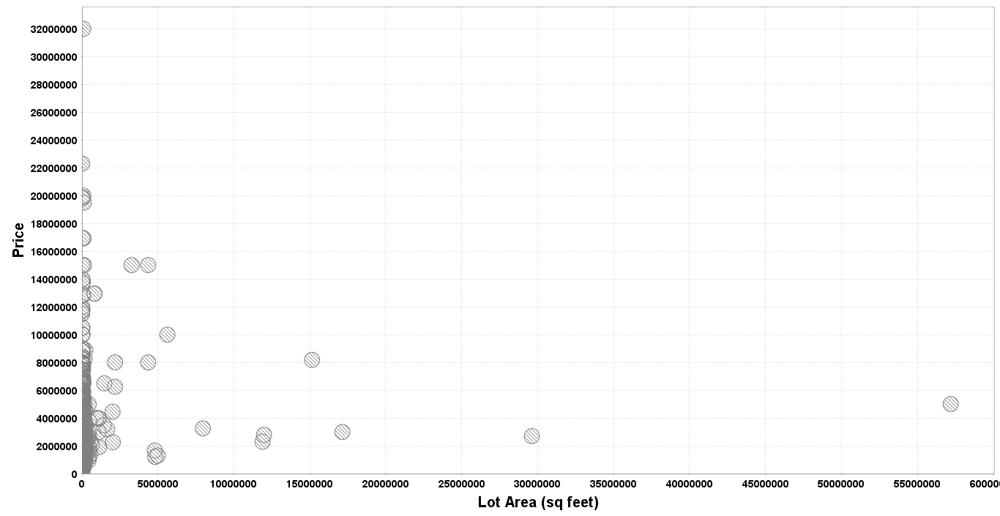

# Predicting Housing Prices in the GTA 


## Data Exploration with spark & breeze-viz

Load data and convert columns to double:

```
import org.apache.spark.sql.SparkSession;
import org.apache.spark.sql.types._;
import org.apache.spark.ml.feature.StringIndexer;
import org.apache.spark.sql.functions.{min, max, log};
import org.apache.spark.sql.DataFrame;
import breeze.plot._;

val spark = SparkSession.builder().master("local[*]")
  .appName("myapp").getOrCreate()

var df = spark.read.format("csv")
  .option("header", "true")
  .load(csvpath)

df.show()
```

To plot data, we cast to double and collect:

```
var price = df.select( df("Price").cast(DoubleType).as("Price") ).collect.map(row => row.getDouble(0));
var lotArea = df.select( df("LotArea").cast(DoubleType).as("LotArea") ).collect.map(row => row.getDouble(0));

// For scatter plot, we need to specify the size of each point. For now, we use constant size:
var size = Array.fill(salePrice.length){100} //units of x-axis

var f = Figure();
var p = f.subplot(0);
p += scatter(lotArea,price,size.apply);
```

The raw data has several outliers in both price and lot area.
- Limit price from $100,000 to $15,000,000
- Limit lot area from 100 sq. feet to 100,000 sq. feet.

```
// Remove outliers
// Price from 100,000 to 10,000,000
var df3 = df2.filter(s"Price > 10000 and Price < 15000000");
// Lot Area from 100 to 20,000
var df4 = df3.filter(s"LotArea > 100 and LotArea < 20000");
```

Now when we plot it again the data looks much better:


We can also look at the distribution of each variable. We see that both variables are right skewed.
```
var f = Figure();
var p = f.subplot(0);
var q = f.subplot(2,1,1);
p += hist(price,bins=100);
p.title = "Price";
q += hist(lotArea,bins=100);
q.title = "Lot Area";
```


We can also look at price per location by changing location to a number using StringIndexer.
We can also make the size of the circles proportional to lot area.
```
var indexer = new StringIndexer()
  .setInputCol("ElectoralDiv")
  .setOutputCol("location")
  .setStringOrderType("alphabetAsc");

var df2 = indexer.fit(df).transform(df);

// Collect
var location = df.select("location").collect.map(row => row.getDouble(0));
var size2 = lotArea.map(_*0.00005)
// Plot
var f = Figure();
var p = f.subplot(0);
p += scatter(location,price,size2.apply);

```


